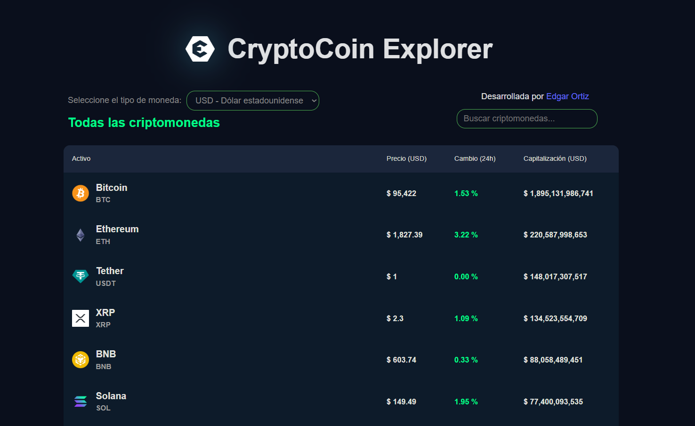

#  CryptoCoin Explorer

[](LICENSE)

[](https://github.com/EdgarOrtiz98/CryptoCoin)

<div align="center">
  
  <p><em>✨ CryptoCoin Explorer es una aplicación web que permite explorar el mercado de criptomonedas con una interfaz moderna. Utiliza la API de CoinGecko para mostrar precios en tiempo real</em></p>
</div>

---

## 🚀 Tecnologías principales
<p align="center">
  
</p>

| Categoría       | Tecnologías                                 |
|-----------------|---------------------------------------------|
| **Frontend**    | React, Vite, JavaScript                     |
| **Estilos**     | CSS Modules                                 |
| **Animaciones** | CSS Transitions                             |
| **Herramientas**| Figma (Diseño), Git (Control de versiones)  |

---

## 📊 Funcionalidades

- Vista general del mercado de criptomonedas
- Conversión de monedas
- Vista detallada de cada cripto
- Actualización en tiempo real de precios

---

## ✨ Características destacadas

✅ **Tema oscuro elegante** con contrastes verdes <br>
✅ **Datos proporcionados por** **[coingecko](https://www.coingecko.com/)**

---

## 🛠️ Configuración local

### Requisitos previos
- Node.js (v18+)
- npm (v9+)

### Instalación
```bash
# Clonar repositorio
git clone https://github.com/EdgarOrtiz98/CryptoCoin.git
cd CryptoCoin

# Instalar dependencias
npm install

# Entorno de desarrollo
npm run dev

# Build para producción
npm run build